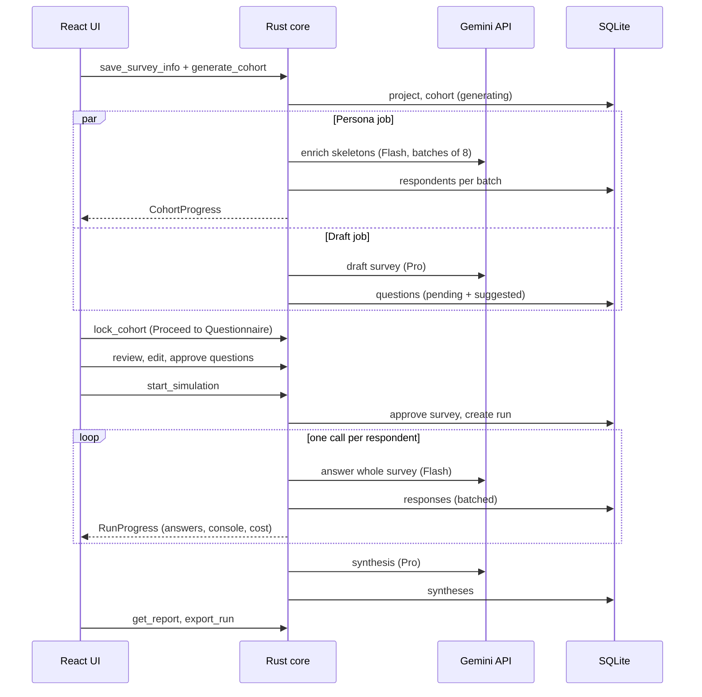

# Data and Backend Flow — Wizard UI

As of 2026-09-23. Maps the five-step wizard in the UI prototype (Survey Info → Personas → Questionnaire → Simulation → Report) to commands, background jobs, Gemini calls and database writes. Where this document and [`SPEC.md`](SPEC.md) differ, this document is newer and wins. Schema: [`schema.sql`](schema.sql).

## 1. Summary

- **Step 1 starts two background jobs at once** when the user clicks Generate Cohort: persona generation and survey drafting. They don't depend on each other, so the draft questionnaire is usually ready by the time the user finishes reviewing personas.
- **Each Gemini task sees only what it needs** (§4). Personas never see the research objective; the survey drafter never sees personas; respondents never see the objective or the reason behind a question.
- **Everything is saved as it happens.** Any step can be left and resumed, and a crash loses at most the in-flight Gemini calls.
- **The backend enforces every gate the UI shows.** A disabled button in the UI matches a check in Rust or a database trigger, so the gates can't be bypassed.



## 2. Project lifecycle and wizard rules

`projects.wizard_step` stores the furthest step reached, so the stepper can show ticks and reopen the project where it was left.

| Step | Can be opened when | Next / main action | Enabled when (checked in Rust too) |
| --- | --- | --- | --- |
| 1 Survey Info | Always | Generate Cohort | Research type chosen, ≥ 1 country, each quota group = 100%, N in 1–1,000 |
| 2 Personas | A cohort exists (generating or ready) | Proceed to Questionnaire | Cohort `ready`; locks it |
| 3 Questionnaire | Cohort locked | Run Survey Simulation | ≥ 1 active question; every active question `accepted` |
| 4 Simulation | A run exists | Stop & Save Progress | Run `running` or `paused` |
| 5 Report | A run is `completed` or `stopped` | Export | Always |

**Going back and changing things.** Earlier results are never overwritten; a change creates a new version.

| Change | Effect downstream |
| --- | --- |
| Countries, N, quotas or screening after the cohort exists | Step 2 shows "Cohort out of date". Regenerate creates a new cohort version; old runs keep pointing at the old one |
| Research type, category or objective after the draft exists | Step 3 offers "Redraft". It replaces only `ai` questions still `pending` or `suggested`; accepted, edited and hand-written ones stay |
| Any question edit after a run | Survey goes back to `in_review` (database trigger). Old runs keep their survey hash |
| Regenerating the cohort | Survey is unaffected, because it never depended on personas |

First launch only: if no Gemini key is stored, the app opens Settings before Step 1 (`set_api_key`, `test_connection`).

## 3. Step by step

### Step 1 — Survey Info

**Inputs from the screen**

| Field | Stored in |
| --- | --- |
| Research Type (Brand / Market Response / Concept) | `projects.research_type` |
| Product Category | `projects.product_category` |
| Project Title | `projects.title` |
| Target Country (multi-select) | `projects.countries_json` |
| Research Objective & Requirements | `projects.research_goal` |
| Number of respondents, quota groups, screening criteria | `cohorts.config_json` (`CohortConfig`) |

**Commands**

- `list_countries() → Vec<CountryOption { code, name, has_census_table, regions }>` — from a bundled `countries.json`. `regions` fills the Region quota group.
- `save_survey_info(project_id?, SurveyInfo) → Project` — autosaves on blur; creates the project on first save.
- `generate_cohort(project_id, CohortConfig, Channel<CohortProgress>) → { cohort_id, survey_id }` — validates the gate above, then starts both jobs and returns immediately.

**Quota groups follow the country selection**

- One country: Age, Region (that country's regions), Household income.
- Several countries: a Country group is added (equal split by default, editable) and Region is dropped. Region quotas across countries make little sense.
- Head counts use largest-remainder rounding in Rust, so each group totals exactly N. The UI computes the same numbers for display only.

**Countries without a census table.** v1 ships a Canada table only (Statistics Canada 2021 Census Individuals PUMF). For other countries, `has_census_table = false`: the sampler draws each quota dimension independently from the user's percentages instead of from real joint distributions. The country shows a "Quotas only, no census table" note in the dropdown.

### Step 2 — Personas (background job 1)

1. **Sample skeletons (Rust, no LLM).** Draw N demographic skeletons, including country, and rake them to the quotas. Seeded, so the same inputs give the same people.
2. **Enrich (Gemini Flash, batches of 8).** Each skeleton gets a name, psychographic background, habits, brand loyalties, 2–4 biases, and a `category_profile` for the chosen product category. For mobile phones that means current device age, current brand and upgrade trigger. The same call checks the screening criteria.
3. **Screening.** A persona that fails is saved with `screen_status = 'failed'` and replaced by a new skeleton from the same quota cell, up to 3 tries. Only `passed` personas count towards N and are used in runs.
4. **Save** each batch in one transaction and send `CohortProgress { done, total, replaced, latest: [RespondentCard] }`.
5. **Summary.** When the job finishes, the cohort becomes `ready` and `get_cohort_summary(cohort_id)` fills the five metric cards:

| Card | Computed from |
| --- | --- |
| Respondents | `COUNT(*)` of passed respondents |
| Average age | `AVG(age)` |
| Gender ratio | Share per `gender` |
| Top upgrade trigger / top interest | Most common value of the category profile's main field (for mobile phones, `upgrade_trigger`) |
| Replaced at screening | Personas that failed screening are kept with `screen_status = 'failed'` (hidden from the grid); the card counts them |

**Commands:** `list_respondents(cohort_id, query, page)` for the grid (search runs in SQLite), `get_respondent(id)` for the drawer, `regenerate_cohort(cohort_id)` (new version, same config), `lock_cohort(cohort_id)` on Proceed.

**Loading state.** With 200 respondents that's 25 calls. At a concurrency of 5 it takes roughly a minute. Step 2 shows a progress bar and fills the grid as batches arrive.

### Step 3 — Questionnaire (background job 2)

**Drafting starts in Step 1**, running alongside job 1. One Gemini Pro call receives research type, category, countries and objective, and returns:

- **Core questions:** saved as active, `origin = 'ai'`, `review_status = 'pending'`. They appear in the left list.
- **Suggestions:** saved inactive, `review_status = 'suggested'`. They appear in the AI suggestions sidebar.

Research type sets a preset for length and focus:

| Research type | Core questions | Suggestions | Focus |
| --- | --- | --- | --- |
| Brand Survey | 10 | 6 | Awareness, consideration, image, loyalty |
| Market Response Survey | 10 | 6 | Purchase intent, price, drivers, barriers |
| Concept Survey | 8 | 6 | Concept appeal, clarity, fit, price, likely use |

The critic (Pro) runs on every drafted, added or regenerated question. Its flags show on the question.

**Commands**

| UI action | Command | Database effect |
| --- | --- | --- |
| Open step | `get_survey(survey_id)` | — |
| Edit type, prompt or options | `update_question(id, patch)` | `origin` `ai` → `ai_edited`; AI original kept in `original_json` |
| Drag or arrow reorder | `reorder_questions(survey_id, ordered_ids)` | `order_index` rewritten in one transaction |
| + New | `add_question(survey_id)` | `origin = 'human'`, `pending` |
| Delete question | `delete_question(id)` | Row deleted if never used in a run, else set inactive |
| Approve question | `approve_question(id)` | `review_status = 'accepted'` |
| + Add to survey | `add_suggestion(id)` | `is_active = 1`, `suggested` → `pending` |
| Suggest more | `suggest_more(survey_id)` | Pro call; new `suggested` rows, deduplicated against existing text |
| Run Survey Simulation | `start_simulation(RunConfig, Channel<RunProgress>)` | One transaction: survey → `approved`, run row inserted. The trigger refuses it if any active question isn't accepted |

### Step 4 — Simulation

**Run setup (inside `start_simulation`)**

- Snapshot the model, temperature, answer mode (default `whole_survey`), prompt version, seed and survey hash.
- Estimate cost and check the daily request quota; if the quota is too low, refuse with a clear error before anything runs.
- Queue every respondent in the locked cohort.

**Per respondent (Gemini Flash):** one call with fixed instructions, then the approved survey with that respondent's option order shuffled, then the persona. It returns an answer and a one-sentence reason for each question. Answers are validated, invalid ones are retried once, and results go to the single database writer.

**What the dashboard shows and where it comes from**

| Dashboard element | Source |
| --- | --- |
| Answers collected (450 / 1,000) | Count of `responses` for the run ÷ (N × active questions) |
| Respondents complete | Respondents with all answers stored |
| API cost so far | Sum over this run's `llm_calls` of uncached input × input price + cached input × cached price + output × output price, using the price table in `settings`. Shown as "$—" until prices are set |
| Average latency, p95 | `llm_calls.latency_ms` for the run's answer calls |
| Throughput | Answers stored in the last 60 s |
| Concurrency | Rate limiter's current value |
| Live console | Latest answers as "[Respondent #n] answered Qk: value because reason", plus rate-limit, retry and save events |
| Live charts | Counts per option, updated from each batch |

**Streaming.** Every 250 ms at most, `RunProgress` sends one message:

```ts
type RunProgress =
  | { kind: "batch"; answered: number; totalAnswers: number; respondentsDone: number;
      costUsd: number | null; avgLatencyMs: number; p95LatencyMs: number; answersPerMin: number;
      concurrency: number; deltas: AnswerDelta[]; console: ConsoleLine[] /* at most 20 */ }
  | { kind: "event"; level: "info" | "warn" | "error"; text: string }   // 429s, retries, refusals
  | { kind: "status"; status: "running" | "paused" | "stopped" | "completed" | "failed" };
type ConsoleLine = { at: string; respondent: number; question: string; answer: string; reason: string };
```

The console is capped at 20 lines per message. The UI keeps the last 500; the full history stays in the database.

**Controls**

- **Pause Simulation** → `pause_run`: calls already in flight finish and are saved; nothing new starts.
- **Stop & Save Progress** → `stop_run`: like pause, then the run becomes `stopped`. That's final, and the report opens on the partial data, with n shown per chart.
- **App closed or crashed:** on next launch the run shows as `paused` and can be resumed with no duplicate answers.

### Step 5 — Report

**`get_report(run_id) → Report`** comes from SQL over `responses`. Chart types follow the question type:

| Question type | Chart | Numbers |
| --- | --- | --- |
| Single choice, ≤ 6 options | Pie (user can switch to bar) | Count and % |
| Single choice, > 6 options | Bar | Count and % |
| Multiple choice | Bar of % choosing each option | Percentages can total more than 100% |
| Likert | Diverging distribution bar | % per point, mean, mean by group |
| Numeric | Histogram | Median, interquartile range |
| Open-ended | Themes list | Theme counts with example quotes |

Cross-tabs group by any quota dimension. Groups under 30 respondents are marked "low base".

**AI synthesis (Gemini Pro).** Runs automatically when a run completes or is stopped, and again on Regenerate.

- **Input:** the report's numbers, the open-ended answers and the research objective.
- **Output:** summary, friction points with mention counts, and segment takeaways, saved in `syntheses` with `based_on_n`.
- **Checks:** Rust verifies every mention count against the theme coding, and every segment it names against real cross-tab groups. Anything that doesn't match is dropped and logged, never shown.

**Exports** (written locally through a save dialog; nothing is uploaded)

- **CSV:** one row per respondent — ID, demographics, country, then one column per question code. Multiple choice becomes one 0/1 column per option. UTF-8 with BOM for Excel. 1,000 answers = 200 rows.
- **JSON:** project, cohort (config and respondents), survey (questions and review history), run settings, answers with reasons, and the synthesis.

## 4. What each Gemini task can see

| Task | Model | Sees | Never sees |
| --- | --- | --- | --- |
| Persona enrichment | Flash | Skeleton, country, product category, screening criteria | Research type, objective, questions |
| Survey draft, suggestions | Pro | Research type, category, countries, objective | Cohort, personas, any answers |
| Critic | Pro | One question and its options | Personas, answers |
| Answering | Flash | Persona, approved questions and options, survey intro | Objective, rationale, critic flags, other respondents |
| Theme coding | Pro | Open-ended answers for one question | Persona identities |
| Synthesis | Pro | Report numbers, open answers, objective | Raw prompts, API key |

Keeping the objective away from persona generation stops personas being written to fit the hypothesis. Keeping it away from answering stops respondents guessing what the researcher wants to hear.

## 5. Schema changes for this flow

All are in [`schema.sql`](schema.sql) and were tested in SQLite.

| Table | Change | Why |
| --- | --- | --- |
| `projects` | `research_type`, `product_category`, `countries_json`, `wizard_step` | Step 1 fields and the stepper |
| `respondents` | `country`, `category_profile_json` | Multi-country cohorts; category facts shown in the drawer and cross-tabs |
| `questions` | `review_status` gains `suggested` | AI suggestions sidebar; suggestions stay inactive until added |
| `simulation_runs` | `status` gains `stopped`; `error` | Stop & Save keeps a reportable partial run; why a run paused itself (bad key, quota spent) |
| `surveys` | `draft_status` (`none`, `generating`, `ready`, `failed`), `draft_error` | Step 3 shows drafting progress and "Draft failed — retry" |
| `simulation_runs` | `synthesis_status` (`none`, `generating`, `ready`, `failed`), `synthesis_error` | Step 5 shows theme coding and synthesis progress, and "Couldn't generate — retry" |
| `llm_calls` | `purpose` gains `suggestion`, `synthesis` | Cost and latency per task |
| `syntheses` (new) | Stores each AI synthesis with model, prompt version and `based_on_n` | Report screen; reproducibility |

## 6. Background jobs and failure handling

Jobs run on the tokio runtime, share one rate limiter and write through the single database writer. Job state lives in status columns, so no separate jobs table is needed.

| Job | Status column | If it fails | After a crash |
| --- | --- | --- | --- |
| Persona generation | `cohorts.status` | Failed batch retried, then split into single calls; persistent failures flagged, the rest kept | Resumes from the last saved batch |
| Survey draft | `surveys.status = 'draft'` until done | Retried once; then Step 3 shows "Draft failed — retry" and still allows writing questions by hand | Restarted |
| Simulation | `simulation_runs.status` | Per-respondent retries; auth errors pause the run | Shown as `paused`; resume skips answered respondents |
| Synthesis | Row in `syntheses` | Report works without it; panel shows "Couldn't generate — retry" | Regenerated on demand |

Rate limits are shared: while a simulation runs, the persona and draft jobs of another project wait on the same limiter, so one project cannot exhaust the daily quota for another unnoticed.

## 7. Open decisions

- [ ] Survey length: the research-type presets (8–10 core questions plus 6 suggestions) are my assumption. Should Step 1 get a length control instead?
- [ ] Countries other than Canada: ship quotas-only sampling in v1 (as above), or limit the country list to countries with a census table?
- [ ] Should "Stop & Save" be resumable later, or final as designed here?
- [ ] Default synthesis trigger: automatic on completion (as designed), or only when the user opens the report?
