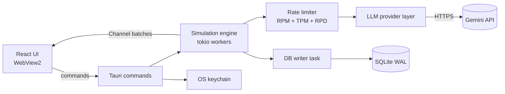
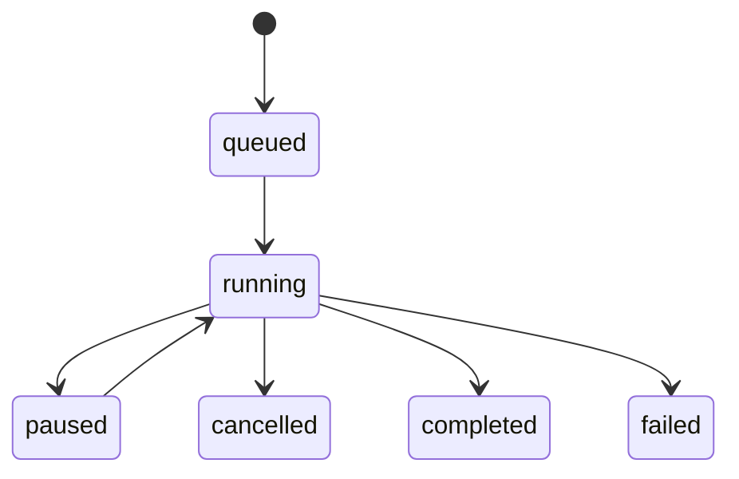

# Synthetic Respondent Survey Harness — Spec

As of 2026-09-23. Living version: https://claude.ai/code/artifact/2e567b8a-6914-4bf1-8c7f-95994153586f

> **UI and data flow:** the five-step wizard (Survey Info → Personas → Questionnaire → Simulation → Report) and its backend flow are specified in [`DATA_FLOW.md`](DATA_FLOW.md). Where the two documents differ, `DATA_FLOW.md` is newer and wins.

## 1. Overview

We will build a Windows desktop app that runs market-research surveys against a cohort of LLM-generated synthetic respondents. Everything runs on the user's machine; the only network traffic is HTTPS calls to the Gemini API.

**Goals**

- Generate a cohort of N personas (default 100, max 1,000) that exactly match user-defined demographic quotas.
- Draft a survey of up to 50 questions with the LLM from a research brief; a person reviews and approves every question before it is used.
- Run the approved survey against the cohort, streaming answers to the UI as they arrive.
- Store every persona, prompt, answer and run setting locally so results can be reproduced and compared.
- Show live distributions, cross-tabs and open-ended themes, and export results to CSV and JSON.

**Non-goals**

- Running LLMs locally. We ship no model.
- Providers other than Gemini in v1. The provider trait keeps other adapters possible later.
- Any hosted backend, user accounts, cloud sync or telemetry.
- Replacing real respondents. The app is for early-stage directional testing, and says so in the UI.

**Hard constraints**

| Constraint | Target |
| --- | --- |
| Distribution | Signed `.msi` / NSIS `.exe` for Windows 10 and 11 |
| Installer size | < 15 MB |
| Backend | Local only: Rust process + embedded SQLite; no server, no Python runtime |
| Network | Outbound HTTPS to the configured LLM endpoint only |
| LLM provider | Google Gemini API for every LLM feature (personas, survey drafting, answers, critic, theme coding, evals) |
| Memory | Rust process ≤ 50 MB and WebView2 renderer ≤ 100 MB, with a 1,000-respondent project open |

## 2. Architecture

The app is a Tauri v2 shell: a React UI in WebView2 talks to a Rust core over typed IPC, and the Rust core owns the database, the API key and every LLM call.



The UI never sees the API key and never runs SQL; it only calls commands and receives progress batches.

**Stack**

| Layer | Choice | Why |
| --- | --- | --- |
| UI | React 18, TypeScript, Tailwind, Lucide, Recharts, TanStack Table + Virtual | Recharts for live charts; virtualised grid for 50k answers |
| IPC types | `ts-rs` | Generates TypeScript types from the Rust data types in `survey-core`; typed `invoke` wrappers live in `src/lib/api.ts` |
| Async | `tokio` | Worker pool, cancellation, channels |
| HTTP | `reqwest` (rustls) | Avoids OpenSSL on Windows |
| LLM client | Own thin Gemini adapter over `reqwest`, behind the `LlmProvider` trait | One provider in v1; keeps binary small |
| JSON schema | `serde`, `schemars` | Persona and answer schemas generated from Rust structs |
| Rate limiting | `governor` | Token buckets for requests per minute, tokens per minute and requests per day |
| Retries | `backoff` | Exponential backoff with jitter |
| Database | `rusqlite` (bundled) + `rusqlite_migration` | Simpler than `sqlx` for one local file |
| Secrets | `keyring` | Windows Credential Manager |
| Sampling | `rand`, `rand_chacha` | Seeded, reproducible quota sampling |

**Rust module layout**

- `commands/` — Tauri command handlers; validation only.
- `engine/` — persona generation, survey drafting, survey runs, cancellation, resume.
- `llm/` — provider trait, adapters, prompt templates, cost table.
- `db/` — migrations, the single writer task, read queries.
- `sampling/` — quota sampler and demographic tables.
- `analysis/` — aggregates, cross-tabs, theme coding.

## 3. Phase 1 — Persona generation

Rust decides who is in the cohort; the LLM only describes them. This guarantees quotas are met exactly and stops the LLM from producing near-identical personas.

**Inputs (`CohortConfig`)**

- Sample size N (1–1,000) and a random seed.
- Quota dimensions: age band, gender, region, income bracket, occupation group, plus up to 3 custom dimensions. Each dimension is a list of `{value, share}` where shares sum to 1.0.
- Optional joint constraints, e.g. "students only in age 18–24".
- Screening criteria in plain text, e.g. "bought a laptop in the last 12 months".
- Base population preset: "Canada adults" or "Custom". Presets ship as small CSV joint-distribution tables built offline from public census microdata; the Canada table comes from the Statistics Canada 2021 Census Individuals PUMF.

**Steps**

1. **Sample demographics in Rust.** Draw N skeletons from the base table, then rake to the quota marginals with iterative proportional fitting. Round with largest-remainder so counts are exact integers. Same seed gives the same cohort.
2. **Enrich in batches.** Send skeletons to the LLM in batches of 5–10. Each call returns, per skeleton, a name, psychographic summary (80–150 words), values, media habits, category attitudes, price sensitivity (1–5) and 2–4 named biases. The call uses structured output against the `PersonaEnrichment` schema.
3. **Diversify.** Each batch prompt lists the short summaries already generated for similar skeletons and tells the model to avoid repeating them. Batches run through the same rate-limited pool as Phase 2.
4. **Screen.** If screening criteria exist, the enrichment call also returns `passes_screen` with a one-line reason. Failed skeletons are redrawn from the same quota cell, up to 3 times, then flagged.
5. **Persist.** Each batch is written in one transaction as soon as it validates. The UI receives progress per batch.
6. **Review.** The user sees the cohort as cards and a quota table (target vs actual), can edit or regenerate single personas, and must click **Lock cohort** before running a survey. A locked cohort is immutable; editing creates a new cohort version.

**Failure handling:** a batch that fails schema validation is retried once with the validation error in the prompt, then split into single-persona calls.

## 4. Phase 2 — Survey drafting and simulation

### 4.1 Survey drafting (LLM-generated, human-reviewed)

Gemini writes the first draft of the survey; a person reviews every question. No question reaches a respondent until a person has accepted it.

**Inputs (`SurveyBrief`)**

- Research goal and the product, concept or topic being tested.
- 1–8 research objectives, e.g. "Measure willingness to pay for the premium tier".
- Target audience, described in words. This is separate from the cohort.
- Number of questions (5–50), preferred mix of question types, and maximum length in minutes.
- Topics or wording to include or avoid, and survey language.

**Steps**

1. **Draft.** One structured-output call to the Pro-tier model returns an intro text and the questions. Each question has a type, text, options or scale, the objective it serves, a one-line rationale and any suggested skip logic. The survey is saved with `status = 'in_review'`, and every question with `origin = 'ai'` and `review_status = 'pending'`.
2. **Automatic critique.** `critique_survey` runs on the draft straight away. Flags such as leading, double-barrelled or loaded wording appear on each question card.
3. **Human review.** For each question the reviewer can:
    - **accept** it as written;
    - **edit** it, which sets `origin = 'ai_edited'` and accepts it (the AI's original is kept in `original_json`);
    - **reject** it;
    - **regenerate** it, optionally with an instruction such as "make it less leading" (one call, replacing the pending question).

    The reviewer can also reorder questions, add their own (`origin = 'human'`) or ask for more questions for an objective.
4. **Coverage check.** The review screen shows each objective with its accepted questions, and warns when an objective has none.
5. **Approve.** `approve_survey` succeeds only when no active question is `pending`, at least one question is accepted and every critic flag has been fixed or dismissed. The survey becomes `approved`. Rejected questions are kept for the record but set inactive.
6. **Edits after approval** send the survey back to `in_review`. Earlier runs are unaffected because each run stores a hash of the survey it used.

**Independence rules**

- The generator never sees the cohort or any persona, so questions cannot be tailored to the respondents who will answer them.
- The generator produces no expected answers or predicted results. Its schema has no field for them, and the prompt forbids predictions in the rationale.
- Respondents see only the intro, question text and options. They never see the objective, rationale or critic flags, so the researcher's intent cannot steer the answers.
- The database refuses to start a run unless the survey is `approved` and every active question is `accepted` (a trigger in `schema.sql`), so the review step can't be bypassed.

### 4.2 Simulation

One task per respondent answers the survey in order, so answers stay consistent and a 100 × 20 survey costs about 100 calls instead of 2,000.

**Answer modes** (set per run)

| Mode | How it works | Use when |
| --- | --- | --- |
| `whole_survey` (default) | One structured-output call returns all answers | Surveys up to ~30 questions, no branching |
| `conversational` | One turn per question, earlier Q&A kept in context | Skip logic, or order effects matter |
| `independent` | One call per question, no memory | Ablation only, to measure order effects |

**Run lifecycle**



1. `start_simulation` creates a `simulation_runs` row that snapshots the model, temperature, prompt version, answer mode, seed and a hash of the survey.
2. The engine loads the locked cohort and survey, and enqueues respondents with no completed answers for this run. This makes resume free.
3. A worker pool of `max_concurrency` tasks (default 10, max 50) pulls respondents. Each call first waits on the rate limiter.
4. Per respondent, option order is shuffled with a seeded RNG for `single_choice` and `multi_choice`; the shown order is stored with the answer.
5. Each answer is validated: the option exists, the Likert value is in range, the multi-choice count is within limits. An invalid answer is retried once with the error in the prompt; after that it is stored with `status = 'invalid'`.
6. Valid answers go to the DB writer task over an `mpsc` channel, which commits in batches of up to 50 rows or every 250 ms.
7. After each commit, the engine sends a progress batch to the UI over a Tauri `Channel`.

**Rate limiting and retries**

- Three `governor` buckets matching Gemini's quota dimensions: requests per minute (RPM), input tokens per minute (TPM) and requests per day (RPD). Defaults come from the user's selected Gemini usage tier and are editable. Tokens are estimated before the call and corrected afterwards.
- Gemini limits apply per Google Cloud project, not per key, so two keys from one project share one budget.
- When the RPD budget would run out mid-run, the run pauses with a message giving the reset time (midnight Pacific).
- HTTP 429 (`RESOURCE_EXHAUSTED`) and 5xx: exponential backoff from 1 s to 60 s with jitter, honouring `Retry-After`, up to 5 attempts.
- If more than 20% of calls in a 60 s window return 429, concurrency drops by half and recovers by 1 every 30 s.
- HTTP 400/401/403: fail fast, pause the run and tell the user.

**Cancel and pause** use a `CancellationToken`. In-flight calls finish and are saved; nothing new starts. A run interrupted by a crash resumes from the database on next launch.

## 5. LLM provider layer

All providers sit behind one Rust trait, so the engine never knows which API it is calling.

```rust
#[async_trait]
trait LlmProvider: Send + Sync {
    async fn complete_structured(&self, req: StructuredRequest) -> Result<StructuredResponse, LlmError>;
    fn capabilities(&self) -> Capabilities; // json_schema, logprobs, prompt_cache, max_output_tokens
    fn estimate_tokens(&self, text: &str) -> u32;
}
```

**Gemini adapter (v1)**

v1 ships one adapter, for the Gemini API `generateContent` endpoint. It uses `generateContent` rather than the newer Interactions API because that API currently lacks token log-probabilities.

| Feature | How the adapter uses it |
| --- | --- |
| Structured output | `generationConfig.responseMimeType = "application/json"` plus a JSON schema generated by `schemars`. Schemas stay flat and avoid `anyOf`, which Gemini supports only partly |
| Prompt caching | Implicit caching (on by default for Gemini 2.5 and newer). The shared prefix must reach the model's minimum (4,096 tokens for Gemini 3.x Flash) to be cached. Cached tokens are read from the usage metadata and stored in `llm_calls.cached_tokens` |
| Log-probabilities | `generationConfig.responseLogprobs` and `logprobs`. Support varies by model, so the adapter probes it in `test_connection` and sets `Capabilities.logprobs` |
| Errors | `429 RESOURCE_EXHAUSTED` → `RateLimited`; 500/503 → `Transient`; 400 → `InvalidRequest`; 401/403 → `Auth`; a response blocked by safety filters is stored with `status = 'refused'` |

**Models.** Model IDs are settings, never hard-coded. Defaults: a Flash-tier model for persona generation and answering; a Pro-tier model for survey drafting, the survey critic, theme coding and eval judging. Prefer stable models over `-preview` ones for defaults. As of September 2026 the Gemini docs list `gemini-3.8-flash` and `gemini-3.1-pro-preview`; `test_connection` lists the models the key can use.

**API key.** The user enters their Gemini key in Settings; it is stored in Windows Credential Manager. CI and development read it from the `GEMINI_API_KEY` environment variable and never write it to disk.

`LlmError` separates `RateLimited { retry_after }`, `Transient`, `InvalidRequest`, `Auth` and `SchemaViolation`, so the engine can choose retry, pause or fail.

**Prompts**

- Templates live in `llm/prompts/*.md`, are compiled into the binary and carry a version string such as `answer.v3`. The version is stored on every run.
- Prompt order is fixed for implicit caching: system rules → survey text and answer schema (identical for every respondent) → persona profile → instruction. Requests for the same survey are sent close together so cache hits are likely.
- The system prompt tells the model to answer as the persona, including uncertainty, indifference and "don't know" where realistic.

**Cost estimate.** Before a run, the UI shows estimated calls, input and output tokens and cost. The estimate uses a user-editable price table per model, stored in settings. Actual tokens from API usage fields are recorded per answer, and the run screen shows actual against estimated.

**Model settings per run:** model ID, temperature (default 1.0), top-p, max output tokens and an optional second Gemini model for comparison runs.

## 6. Database schema (SQLite)

The schema adds cohorts, surveys, runs and an LLM call log to the original draft. Re-runs never overwrite earlier results, and every answer can be traced to its prompt, model and cost. The full DDL is in [`schema.sql`](schema.sql) and was tested in SQLite 3.

**Changes from the draft**

- `surveys` table added; the draft's commands took a `survey_id` that had no table. It also stores the review status, the brief and the generator model and prompt version.
- `cohorts` added, so a project can hold several cohort versions and each run points at a locked one.
- `simulation_runs` added; the unique key is now `(run_id, question_id, respondent_id)` instead of `(question_id, respondent_id)`.
- `questions.is_active`, `code`, `skip_logic_json` and a `numeric` type added, plus review fields: `origin` (ai, ai_edited, human), `review_status`, `objective`, `rationale` and the AI's `original_json`.
- Triggers: a run can only be inserted for an approved survey whose active questions are all accepted, and editing an approved survey's questions reopens it for review.
- Answers stored as `answer_json`, with `answer_code` and `answer_value` copied out for fast charts.
- Token, latency and error data moved to `llm_calls`.
- Timestamps are ISO-8601 UTC text; JSON columns have `json_valid` checks; indexes cover the main queries.

**Connection rules**

- Every connection runs the four `PRAGMA` lines at the top of `schema.sql`, including `foreign_keys = ON`.
- Exactly one writer connection, owned by the DB writer task; reads use a small pool of read-only connections.
- Migrations run at startup with `rusqlite_migration`. The file lives at `%APPDATA%\SyntheticSurvey\data.db`.

**Tables**

| Table | Purpose |
| --- | --- |
| `projects` | Top-level container: title, research goal |
| `cohorts` | A versioned set of respondents with its `CohortConfig`; locked before use |
| `respondents` | One persona: demographics, quota cell, psychographics, full persona JSON, screen status |
| `surveys` | Versioned survey per project, with brief, generator model and review status |
| `questions` | Ordered questions with type, options/scale JSON, skip logic, active flag, and origin and review status |
| `simulation_runs` | One execution: survey × cohort × model settings × prompt version × seed |
| `llm_calls` | Every API call: purpose, attempt, status, tokens, latency, error, optional raw payloads |
| `responses` | One answer per run × question × respondent, with shown option order and optional option probabilities |
| `themes`, `response_themes` | Open-ended coding results |
| `settings` | Key-value app settings (never the API key) |

## 7. Tauri commands and events

These contracts are fixed first, so frontend and backend can be built in parallel. Types are Rust structs exported to TypeScript with `ts-rs` (into `src/types/gen/`). Every command returns `Result<T, AppError>`, where `AppError` has a `code` and a human-readable `message`.

**Commands**

| Command | Input | Returns |
| --- | --- | --- |
| `list_projects` / `create_project` / `update_project` / `delete_project` | project fields | `Project` |
| `create_cohort` | `project_id`, `CohortConfig` | `Cohort` (status `draft`) |
| `generate_cohort` | `cohort_id`, `ModelSettings`, `Channel<CohortProgress>` | `JobId` |
| `regenerate_respondent` | `respondent_id`, optional instruction | `Respondent` |
| `update_respondent` | `respondent_id`, patch | `Respondent` (draft cohorts only) |
| `lock_cohort` | `cohort_id` | `Cohort` |
| `list_respondents` | `cohort_id`, page | `Page<Respondent>` |
| `draft_survey` | `project_id`, `SurveyBrief` | `Survey` (status `in_review`, questions `pending`) |
| `regenerate_question` | `question_id`, optional instruction | `Question` (`pending`) |
| `add_generated_questions` | `survey_id`, objective, count, optional instruction | `Vec<Question>` (`pending`) |
| `review_question` | `question_id`, `accept` \| `reject` \| `edit(patch)` | `Question` |
| `dismiss_critic_flag` | `question_id`, flag id, reason | `QuestionIssue` |
| `approve_survey` | `survey_id` | `Survey` (`approved`), or `AppError` naming the pending questions and open flags |
| `save_survey` | `project_id`, `SurveyDraft` | `Survey` (bumps `version`; hand-written questions are saved as `accepted`) |
| `critique_survey` | `survey_id` | `Vec<QuestionIssue>` |
| `estimate_run` | `RunConfig` | `CostEstimate` |
| `start_simulation` | `RunConfig`, `Channel<RunProgress>` | `RunId` |
| `pause_run` / `resume_run` / `cancel_run` | `run_id` | `RunStatus` |
| `get_run_summary` | `run_id` | `RunSummary` (counts, tokens, cost, errors) |
| `get_distribution` | `run_id`, `question_id`, optional `group_by` | `Distribution` |
| `get_crosstab` | `run_id`, `question_id`, `by` (demographic or question) | `Crosstab` |
| `code_open_ended` | `run_id`, `question_id` | `JobId` |
| `list_responses` | `run_id`, filters, page | `Page<ResponseRow>` |
| `export_run` | `run_id`, `csv` \| `json`, path | file path |
| `set_api_key` / `has_api_key` / `delete_api_key` | provider | `()` / `bool` |
| `get_settings` / `update_settings` | settings patch | `Settings` |
| `test_connection` | provider profile | latency, model list |

**Progress streams**

Progress uses per-command Tauri v2 `Channel`s, not global `emit`, so a closed window cannot receive stale events. Messages are batched every 250 ms at most.

```ts
type RunProgress =
  | { kind: "batch"; completed: number; total: number; answers: AnswerDelta[];
      tokensIn: number; tokensOut: number; costUsd: number }
  | { kind: "throttled"; concurrency: number; retryInMs: number }
  | { kind: "error"; respondentId: number; code: string; message: string }
  | { kind: "status"; status: "running" | "paused" | "cancelled" | "completed" | "failed" };

type AnswerDelta = { questionId: number; respondentId: number;
                     code?: string; codes?: string[]; value?: number };
```

`CohortProgress` has the same shape, with `personas` in place of `answers`. The UI updates chart state incrementally from `AnswerDelta`s and only calls `get_distribution` on load or when filters change.

## 8. Response validity and calibration

The app must make the known weaknesses of LLM respondents visible and measurable. Otherwise users will read synthetic numbers as real ones.

**Known failure modes to design against**

| Failure | Mitigation in v1 |
| --- | --- |
| Too little variance; answers cluster on the "typical" option | Temperature ≥ 1.0 by default; persona-specific biases in the prompt; show a variance metric per question |
| Central tendency and agreeableness on Likert items | Prompt allows strong and negative views; mix reversed items; flag questions where more than 60% pick the midpoint |
| Option-order effects | Seeded shuffle per respondent; order stored; order-effect check in the fidelity report |
| Opinions skewed toward some groups | Demographics from census-based tables; cross-tabs by demographic on every chart |
| Invented certainty | "Don't know" and "Prefer not to say" offered where a real survey would offer them |
| Model-specific quirks | Comparison runs: same cohort and survey on a second model, shown side by side |

**Distribution mode.** When the selected Gemini model supports log-probabilities, a choice question can also record each option's probability in `option_probs_json`. The UI can then chart the average probability per option next to the sampled counts. This is off by default and hidden when the model does not support it.

**Fidelity calibration (AI-generated benchmark).** There is no real-world survey data for v1, so the benchmark pack is AI-generated. An AI-generated "real result" would only measure how closely one LLM agrees with another, so the pack does not use LLM opinions as ground truth. It uses **planted ground truth** instead:

1. A Gemini Pro-tier model proposes candidate questions across choice, Likert and numeric types, each tied to one persona attribute (for example price sensitivity, age band or a stated bias). It writes **questions only**: no rules, no expected answers (decision D1).
2. A person keeps about 20 and writes, for each, the rule that maps the attribute to an expected answer distribution (for example "price sensitivity 4–5 → 50% the cheapest option, 35% refurbished"). The question must not name its attribute.
3. The expected distribution for any cohort is computed from its personas' attributes with that rule. It is exact and needs no LLM.
4. The pack is frozen, versioned and committed as `benchmarks/fidelity.v1.json` (`status: "frozen"`, `reviewed_by`, `frozen_at`), never regenerated at run time. Release runs refuse an unfrozen pack. Tools: `fidelity candidates`, `fidelity check`, `fidelity run` in the `survey-evals` crate.

Running the pack against a cohort measures **fidelity**: whether persona attributes actually drive answers. It gives:

- per-question total variation distance between the expected and synthetic distributions;
- the mean across questions, shown as a fidelity score from 0 to 100;
- the demographic subgroups where fidelity is worst.

**Label-free checks (decision D3).** Every question in every run also gets checks that need no expected answers, shown under its chart in Step 5 and in the fidelity report: normalised entropy (flag below 0.4), Likert midpoint share (flag above 60%), and, for shuffled single-choice questions, first- vs last-position choice rates (flag a gap of 5 points or more with p < 0.05).

**What this does not measure.** Fidelity is not realism. The pack cannot show whether synthetic answers match what real people would say. The UI labels the score "Fidelity" rather than "Accuracy", and results carry the disclosure below. Real-world calibration becomes possible if real survey results are added later; the pack format allows a `ground_truth: "observed"` source for that.

**UI disclosure.** Every results screen and export carries the line "Synthetic respondents — directional only; not calibrated against real survey data" plus the run's model and prompt version.

## 9. UI screens and analytics

The app has six screens reached from a left sidebar inside a project. Every screen works offline except the actions that call the LLM.

| Screen | Contents | Key interactions |
| --- | --- | --- |
| Projects | List with last run, cohort size, fidelity score | Create, duplicate, delete, open |
| Cohort builder | Size, seed, population preset, quota editor (sliders that keep shares at 100%), screening text | Live preview of quota counts; Generate |
| Cohort review | Persona cards, virtualised table, target-vs-actual quota table | Filter, edit, regenerate one, Lock cohort |
| Survey brief | Research goal, objectives, audience description, question count and type mix, include/avoid topics | Generate draft |
| Survey review | Question cards with origin, objective, rationale and critic flags; objective coverage panel; progress (for example "14 of 20 reviewed") | Accept, edit, reject, regenerate with instruction, add question, reorder; Approve survey |
| Run | Model settings, answer mode, concurrency, cost estimate; then live progress, tokens, cost, throttle and error log | Start, pause, resume, cancel |
| Results | Per-question charts, cross-tabs, open-ended themes with example quotes, response grid, run comparison | Group by demographic, filter, export |

**Chart rules**

- Choice questions: horizontal bars sorted by the question's own option order, with counts and percentages.
- Likert: diverging stacked bar centred on the midpoint, plus the mean.
- Numeric: histogram with median and interquartile range.
- Cross-tabs: grouped bars, or a heatmap table when there are more than 5 groups.
- Comparison runs: the two runs side by side on the same axis.
- Every chart shows n, and bars with fewer than 30 respondents are marked as low base.

**Open-ended coding.** After a run, `code_open_ended` sends answers in batches of 50 to the LLM, which proposes up to 12 themes. A second pass assigns each answer to 0–3 themes. The user can rename, merge or delete themes; edits are saved in `themes`.

**Exports**

- CSV: one row per respondent, one column per question code, demographics first; a second file holds open-ended text.
- JSON: full run, including cohort, survey, settings and answers.
- PNG: any chart.

## 10. Security, privacy and packaging

The API key never leaves Rust, and survey content leaves the machine only in calls to the endpoint the user configured.

**Security**

- API keys are stored with `keyring` in Windows Credential Manager, one entry per provider profile. They are never written to SQLite, logs or exports.
- Tauri capabilities allow only this app's own commands. The shell, fs, http and sql plugins are not enabled for the webview.
- Content Security Policy: `default-src 'self'`; no remote scripts; `connect-src` limited to IPC.
- All outbound HTTP comes from Rust `reqwest`, using an allow-list of the configured base URLs.
- Logs go to `%APPDATA%\SyntheticSurvey\logs`, rotate at 5 MB and redact `Authorization` headers.

**Privacy**

- The settings screen states which provider receives survey text and personas.
- Storing raw prompts and responses is off by default.
- For confidential concepts, users are told to use a paid-tier Gemini API project; Google's terms for the free tier allow prompts to be used to improve its products. Check the current Gemini API terms before release.
- No telemetry and no update checks unless the user turns on the updater.

**Packaging**

| Item | Decision |
| --- | --- |
| Bundler | Tauri v2 NSIS `.exe` and WiX `.msi` |
| WebView2 | Download bootstrapper; Windows 11 already includes it |
| Rust release profile | `opt-level = "s"`, `lto = true`, `codegen-units = 1`, `strip = true`, `panic = "abort"` |
| Size budget | Rust binary ≤ 8 MB, frontend ≤ 2 MB gzipped, demographic tables ≤ 1 MB; CI fails above 15 MB |
| Code signing | Authenticode certificate, so SmartScreen does not warn users |
| Updates | Optional `tauri-plugin-updater` with signed releases, off by default |
| CI | GitHub Actions on `windows-latest` for lint, test, build and size check; Windows 11 VMs for release tests (see test plan §6) |

## 11. Milestones, acceptance and open questions

The build is split into five milestones. M1 fixes the contracts so frontend and backend work can run in parallel after it. Task-level detail is in [`IMPLEMENTATION_PLAN.md`](IMPLEMENTATION_PLAN.md).

| Milestone | Scope | Done when |
| --- | --- | --- |
| M1 Skeleton | Tauri app, migrations, command stubs, generated TS bindings, keychain, settings, CI with size check | Installer builds under 15 MB; `test_connection` works for one provider |
| M2 Cohorts | Quota sampler, persona enrichment, cohort review, lock | 100 personas match quotas exactly; same seed gives same demographics |
| M3 Simulation | Survey drafting and review, worker pool, rate limiter, retries, pause/resume/cancel, live progress | Acceptance tests below pass |
| M4 Analytics | Distributions, cross-tabs, theme coding, exports, comparison runs | CSV opens correctly in Excel; charts update live |
| M5 Validity | Fidelity benchmark pack and report, option shuffling checks, disclosure, code signing | Fidelity report runs end to end on the default Gemini model |

**Acceptance tests**

- 100 respondents × 20 questions in `whole_survey` mode finish in under 3 minutes at 10 concurrent calls with no provider limits hit.
- Killing the app mid-run and relaunching resumes with no duplicate or lost answers.
- A forced 30% rate of HTTP 429 responses from a mock server still completes the run, with concurrency reduced.
- UI stays at 60 fps with 1,000 respondents streaming; memory stays under 150 MB.
- No API key appears in the database, logs or exports (checked by a test that searches all three).
- The same run config and seed gives identical cohorts and identical option orders.

**Testing approach.** A mock LLM server in Rust (`wiremock`) returns scripted, slow or failing responses, so all engine tests run offline and cost nothing. Frontend uses Vitest and Playwright against the mock.

**Future work**

- **Focus-group mode.** 4–8 personas discuss a concept in turns, led by a moderator persona. This is the one feature where multi-agent interaction adds real value. It needs a simple turn loop in Rust, not an agent framework.
- Conjoint and MaxDiff question types.
- Image stimuli for concept tests, using multimodal models.
- Weighting results to target margins after the run.

**Decisions (2026-09-23)**

- Memory budget is split: Rust process ≤ 50 MB, WebView2 renderer ≤ 100 MB.
- Gemini is the only v1 provider and must work for every LLM feature, including eval judging.
- The calibration pack is AI-generated with planted ground truth (§8).
- Surveys are drafted by Gemini and every question is reviewed by a person before use (§4.1).
- Release-tier performance and install tests run on Windows VMs.

**Open questions**

- [ ] Which Gemini usage tier is the project on? It sets the default RPM, TPM and RPD limits and the safe default concurrency.
- [ ] Windows 10 left mainstream support in October 2025. Keep it as a supported target, or ship Windows 11 only?
- [ ] Is a code-signing certificate available, or does v1 ship unsigned for internal use?
- [x] Which base populations are needed first? **Decided: Canada** (2021 Census PUMF). Other countries use quotas-only sampling until they get a table.
- [ ] Is the 1,000-respondent limit enough, or is 5,000+ needed?
- [ ] Should `whole_survey` stay the default answer mode, or should `conversational` be the default?
- [ ] Should approval need a second reviewer for surveys used in decisions, or is one reviewer enough?
